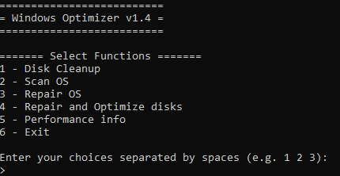

# Windows-Optimizer v1.4

This tool was created to optimize all Windows Computers. One of the culprits of slow systems is found on the hard drive, especially the spinning drives HDDs. This tool will take care of automating the optimization of those drives and more!

# Instructions:
- Right click on the .bat file and click on "Run As Administrator".
- Select your options as: 1 2 3 4
- Press Enter to run.

# Available Tasks:
- Run Disk CleanUp.
- Scan Windows OS integrity using SFC and DISM.
- Repair Windows OS using DISM
- Repair and Optimizes disks (HDD or SSD). Runs chkdsk to find and repair errors, and defags (if HDD) or Retrims (if SSD)
- Runs Performance Monitor. Checks CPU usage and processes using most CPU (to spot issues or malware like crypto miners). It also checks the computer uptime, asking the user to reboot if the uptime is longer than 7 days.

# Features:
- It is able to identify all your disks.
- Checks if the disk is SSD or HDD. 
- For HDD drives, it will analyse it first, and identify if it needs defragging. It will only defrag if it is needed, saving time.
- Identifies if disks have errors, and only runs a more thourough chkdsk scan if errors are found.
- Identifies processes using most CPU time using Powershell, and so spotting stealthy cpu intensive malware. Some cryptominers might kill themselves when launching the task manager to view resources.

# Image:

